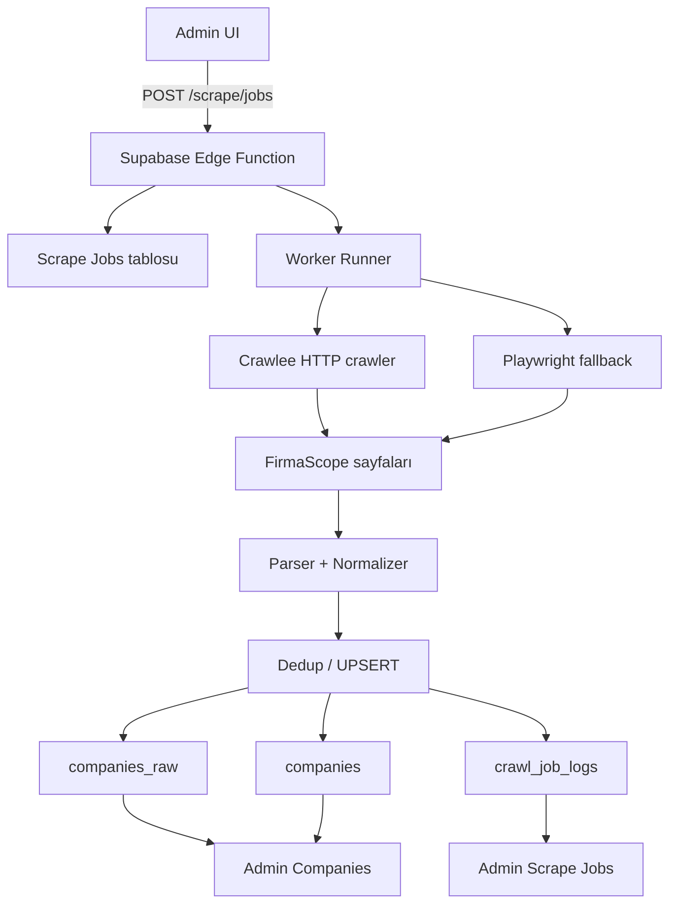
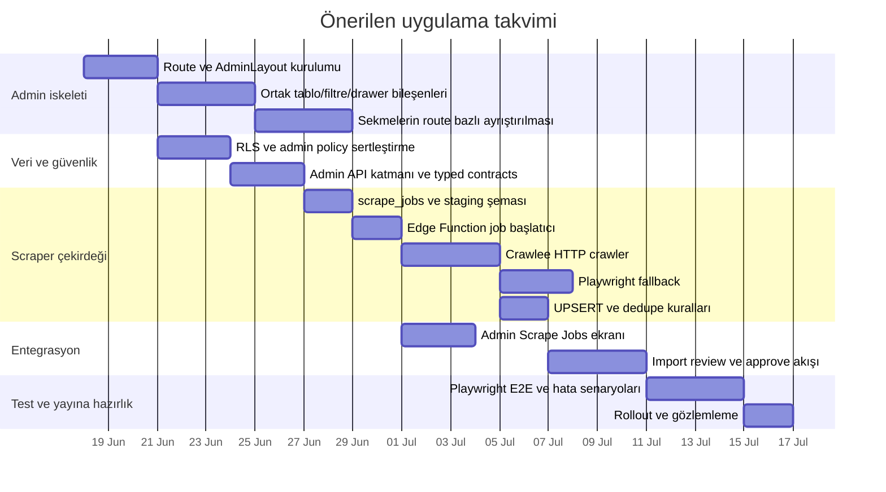

# FirmaScope admin eşleme ve şirket scraping tasarımı

## Yönetici özeti

Elimdeki doğrulanabilir kanıt seti, bu oturuma yüklenmiş iç tasarım notu ve resmi dokümantasyonlarla sınırlı kaldı. Yüklenen not, FirmaScope’un mevcut yığınının **React + TypeScript + Supabase + shadcn/ui** olduğunu; kamuya açık tarafta `/sirketler` ve `/sirket/:slug` rotalarının kullanıldığını; şirket detayında “Genel Bakış, Yorumlar, Maaşlar, Mülakatlar” sekmelerinin bulunduğunu; `/admin` altında da **9 sekmeli** bir yönetim kurgusunun tasarlandığını doğruluyor. Aynı notta `CompanyDetail.tsx`, `ReviewForm.tsx`, `InterviewForm.tsx` ve öneri olarak `AdminPosts.tsx` isimli bileşenlerden söz ediliyor. fileciteturn0file0

Bu nedenle, aşağıdaki rapor iki katmanlı hazırlanmıştır. Birinci katman, **mevcut FirmaScope tarafında doğrulanabilen parçaları** haritalar. İkinci katman ise, **`ubterzioglu/corteqsmvp` ile eşleştirilecek hedef admin iskeletini** implementasyon düzeyinde tanımlar; ancak bu repo içeriği bu oturumda doğrulanamadığı için, `corteqsmvp` tarafındaki “exact file path / exact class” alanlarını açık biçimde **unspecified** olarak işaretledim. Bu ayrımı bilerek korudum; çünkü siz özellikle “unspecified ise belirt” dediniz. fileciteturn0file0

Teknik olarak en güvenli ve sürdürülebilir yol, scraping işini **istemci tarafında değil**, **sunucu tarafında çalışan kuyruklu bir işleyici** olarak tasarlamaktır. Supabase Edge Functions, JWT doğrulama, rate-limit ve merkezî güvenlik kontrolleri için doğal bir sınır katmanı sunar; RLS ise admin paneli ile ham crawl verisi arasına güçlü bir yetkilendirme katmanı koyar. Crawlee, HTTP ve gerçek tarayıcı taramasını tek arayüzde birleştiren, kuyruk, retry, session management ve depolama soyutlamaları sağlayan uygun bir çekirdektir; Playwright ise JS-rendered sayfalarda fallback motoru olarak uygundur. PostgreSQL `ON CONFLICT` UPSERT modeli de şirket kayıtlarının deduplikasyonunda atomik sonuç verir. citeturn18view1turn18view2turn20view0turn20view1turn24view0

Hukuki ve güvenlik tarafında kritik nokta şudur: robots.txt yönergeleri teknik erişim kontrolü değildir, fakat standart dışı davranmak operasyonel ve hukuki riski yükseltir; crawler’ın kendini açık bir `User-Agent` ile tanıtması ve robots kurallarını onurlandırması gerekir. Türkiye’de kişisel veriler için KVKK’nın “hukuka ve dürüstlük kurallarına uygunluk”, “belirli, açık ve meşru amaç”, “ilgili, sınırlı ve ölçülü olma” ilkeleri doğrudan önemlidir. Bu nedenle admin entegrasyonu yalnızca şirket odaklı alanları toplamalı; kişi adı, telefon, e-posta gibi disipline tabi alanlar ya hiç tutulmamalı ya da çok açık gerekçe ve yetkilendirme ile tutulmalıdır. citeturn21view0turn21view1turn21view2turn21view3turn21view4

## Kanıt tabanı ve belirsizliklerin sınırı

Bu çalışmada güvenle söyleyebildiğim repo-tabanlı gerçekler, yüklenen tasarım notundan geliyor. Buna göre FirmaScope tarafında aşağıdaki unsurlar doğrulanıyor: teknoloji yığını React + TypeScript + Supabase + shadcn/ui; şirket listeleme rotası `/sirketler`; detay rotası `/sirket/:slug`; detay sekmeleri “Genel Bakış, Yorumlar, Maaşlar, Mülakatlar”; admin tasarımında `/admin` altında “Duyurular, Öneriler, Talepler, Şirketler, Yorumlar, Maaşlar, Mülakatlar, Kullanıcılar, Raporlar” sekmeleri; ayrıca `CompanyDetail.tsx`, `ReviewForm.tsx`, `InterviewForm.tsx` dosya adları ve yeni öneri bileşeni olarak `AdminPosts.tsx`. Yine aynı not, `companies`, `reviews`, `salaries`, `interviews`, `profiles`, `company_claims`, `company_suggestions`, `reports` tablolarına ve `company-assets` bucket’ına işaret ediyor. fileciteturn0file0

Doğrulanamayan alanları bilerek ayırıyorum. Bu oturumda şu unsurlar **unspecified** kaldı: canlı `https://firmascope.com/admin` sayfasının gerçek DOM yapısı; `ubterzioglu/corteqsmvp` repo içindeki gerçek dosya ağacı; `firmascope` repo içindeki exact klasör yapısı; mevcut admin’in responsive breakpoint davranışı; mevcut scraper bileşenlerinin exact dosya ve fonksiyon isimleri; admin yetkilendirmesinin halihazırda route-guard mı, middleware mi, yoksa yalnızca UI-gating ile mi çalıştığı; scraping için hedef site tarafında login gerekip gerekmediği. Bu belirsiz alanların tamamını aşağıda ya “unspecified” diye notladım ya da “önerilen implementasyon” olarak çerçeveledim.

Bu sınırlama altında doğru yaklaşım, önce **layout ve veri sözleşmelerini sabitlemek**, sonra `corteqsmvp` repo erişimi açıldığında yalnızca “görüntü katmanı ince ayarı” yapmaktır. Çünkü route nesting, admin shell, tablo/filtre/panel kompozisyonu ve scraper API sözleşmesi repo-detayı olmadan da güvenli şekilde tasarlanabilir. React Router’ın nested route ve layout route modeli, tam da bu tür admin-shell tasarımları için uygundur: parent route içinde `<Outlet />` ile child sayfalar render edilir; `path` olmayan layout route’lar URL segment eklemeden ortak kabuğu paylaşır. citeturn19view0turn18view0

## Admin UI eşleme

Doğrulanabilen FirmaScope admin yapısı, bugün için sekme temelli bir moderasyon ve operasyon paneli. `corteqsmvp` eşlemesi hedeflenirken, en doğru yaklaşım, sekme mantığını içeride koruyup dış kabuğu **tek bir AdminLayout + sol gezinme + üst eylem çubuğu + içerik alanı** modeline taşımaktır. Böylece hem mevcut işlevleri bozmadan korunur, hem de daha ölçeklenebilir bir layout yapısı elde edilir. Bu ayrıca React Router’ın nested route modeliyle doğrudan uyumludur. fileciteturn0file0 citeturn19view0turn18view0

### Doğrulanmış FirmaScope yüzeyi ve hedef corteqsmvp benzeri eşleme

| FirmaScope yüzeyi | Doğrulanmış mevcut durum | Hedef corteqsmvp-benzeri pattern | Route önerisi | Reuse adayı | CSS / layout önerisi | Responsive durum |
|---|---|---|---|---|---|---|
| Admin kök | `/admin` altında 9 sekmeli yapı var | `AdminLayout` + sol nav + içerik paneli | `/admin` | Mevcut admin logic, tablo sorguları | `min-h-screen`, `grid`, `lg:grid-cols-[260px_1fr]`, `overflow-hidden` | Mevcut davranış unspecified; öneri: `<lg` drawer |
| Duyurular | Sekme mevcut | Liste + create/edit drawer | `/admin/announcements` | Var olan duyuru CRUD mantığı, exact file unspecified | `space-y-6`, `flex flex-col gap-4` | Unspecified |
| Öneriler | Sekme mevcut | Inbox/list moderation page | `/admin/suggestions` | `company_suggestions` veri katmanı | `grid gap-4` + filtre bar | Unspecified |
| Talepler | Sekme mevcut | Claim/request review board | `/admin/claims` | `company_claims` veri katmanı | split pane önerilir | Unspecified |
| Şirketler | Sekme mevcut | Master list + detail drawer | `/admin/companies` | `CompanyDetail.tsx` alan modeli | `table + drawer` veya `list + sidepanel` | Unspecified |
| Yorumlar | Sekme mevcut | Moderation queue | `/admin/reviews` | `reviews` tablosu + `ReviewForm.tsx` alan seti | `data-table`, sticky filters | Unspecified |
| Maaşlar | Sekme mevcut | Moderation + aggregates view | `/admin/salaries` | `salaries` tablosu | `table`, `card` aggregate ribbon | Unspecified |
| Mülakatlar | Sekme mevcut | Moderation queue | `/admin/interviews` | `interviews` tablosu + `InterviewForm.tsx` alan seti | `table`, `details sheet` | Unspecified |
| Kullanıcılar | Sekme mevcut | User admin page | `/admin/users` | `profiles` tablosu | `table`, search, status badge | Unspecified |
| Raporlar | Sekme mevcut | Abuse / moderation page | `/admin/reports` | `reports` yapısı | Kanban veya severity-first list | Unspecified |
| Gönderiler | Mevcutta öneri olarak geçiyor | Yeni moderasyon sekmesi | `/admin/posts` | Önerilen `AdminPosts.tsx` | `table`, bulk actions | Unspecified |

Kaynak notu: Tabloda “doğrulanmış” sütununda yalnızca iç nottan doğrulanan öğeler kullanıldı; `corteqsmvp`-tarzı pattern sütunu ise implementasyon hedefidir. fileciteturn0file0

### Dosya ve bileşen eşleme durumu

Aşağıdaki tablo özellikle “exact file path” beklentiniz için ikiye ayrılmıştır: doğrulanabilen dosya adları ve önerilen konumlar.

| Bileşen / dosya | Durum | Doğrulanmış mı | Önerilen yol | Rol |
|---|---|---:|---|---|
| `CompanyDetail.tsx` | İç notta adı geçiyor | Evet | `src/components/company/CompanyDetail.tsx` | Şirket özet kartı, meta alanları, admin önizleme |
| `ReviewForm.tsx` | İç notta adı geçiyor | Evet | `src/components/reviews/ReviewForm.tsx` | Review create/edit form kalıbı |
| `InterviewForm.tsx` | İç notta adı geçiyor | Evet | `src/components/interviews/InterviewForm.tsx` | Interview create/edit form kalıbı |
| `AdminPosts.tsx` | Yeni öneri bileşeni | Evet, öneri olarak | `src/pages/admin/AdminPosts.tsx` | Yeni gönderi moderasyon paneli |
| Admin layout dosyası | Unspecified | Hayır | `src/layouts/AdminLayout.tsx` | Ortak admin shell |
| Route tanımı | Unspecified | Hayır | `src/router/admin-routes.tsx` veya `src/App.tsx` | Nested routing |
| Data table ortak bileşeni | Unspecified | Hayır | `src/components/admin/DataTable.tsx` | Liste sayfaları için ortak tablo |
| FilterBar | Unspecified | Hayır | `src/components/admin/FilterBar.tsx` | Arama/filtre üst çubuğu |
| SidePanel / Drawer | Unspecified | Hayır | `src/components/admin/EntityDrawer.tsx` | Detay düzenleme paneli |

Bu raporda `src/...` yolları **önerilen implementasyon yollarıdır**; repo erişimi olmadan exact konum olduklarını söylemiyorum.

### Yerleşim ve yönlendirme reçetesi

React Router’ın parent-child nesting ve layout route modeli, admin kabuğunu tek yerde tutup alt sayfaları `<Outlet />` üzerinden render etmeye izin verir. Bu nedenle önerilen yapı, `AdminLayout` içinde sol gezinme, üst aksiyon çubuğu ve içerik alanı; child route olarak da `announcements`, `suggestions`, `claims`, `companies`, `reviews`, `salaries`, `interviews`, `users`, `reports`, `posts` sayfalarıdır. citeturn19view0turn18view0

```tsx
// Önerilen yol: src/router/admin-routes.tsx
import { Route } from "react-router";
import AdminLayout from "@/layouts/AdminLayout";
import AdminDashboard from "@/pages/admin/AdminDashboard";
import AdminAnnouncements from "@/pages/admin/AdminAnnouncements";
import AdminSuggestions from "@/pages/admin/AdminSuggestions";
import AdminClaims from "@/pages/admin/AdminClaims";
import AdminCompanies from "@/pages/admin/AdminCompanies";
import AdminReviews from "@/pages/admin/AdminReviews";
import AdminSalaries from "@/pages/admin/AdminSalaries";
import AdminInterviews from "@/pages/admin/AdminInterviews";
import AdminUsers from "@/pages/admin/AdminUsers";
import AdminReports from "@/pages/admin/AdminReports";
import AdminPosts from "@/pages/admin/AdminPosts";

export const adminRoutes = (
  <Route path="admin" element={<AdminLayout />}>
    <Route index element={<AdminDashboard />} />
    <Route path="announcements" element={<AdminAnnouncements />} />
    <Route path="suggestions" element={<AdminSuggestions />} />
    <Route path="claims" element={<AdminClaims />} />
    <Route path="companies" element={<AdminCompanies />} />
    <Route path="reviews" element={<AdminReviews />} />
    <Route path="salaries" element={<AdminSalaries />} />
    <Route path="interviews" element={<AdminInterviews />} />
    <Route path="users" element={<AdminUsers />} />
    <Route path="reports" element={<AdminReports />} />
    <Route path="posts" element={<AdminPosts />} />
  </Route>
);
```

### Responsive davranış önerisi

Canlı admin’in breakpoint davranışı **unspecified** olduğu için bunu doğrulanmış gerçek gibi anlatmıyorum. Yine de uygulanabilir bir standart öneri şudur: `lg` ve üstünde kalıcı sol sidebar; altında drawer/sheet; filtre çubuğu mobilde iki satıra düşmeli; tablolar `overflow-x-auto` ile yatay scroll almalı; detay düzenleme formları `Drawer/Sheet` yerine mobilde tam ekran route (`/admin/companies/:id`) olarak açılmalı. Bu yapı shadcn/ui ve nested route modeline doğal oturur; ayrıca “sekme-temelli mevcut panel” ile çakışmadan ilerletilebilir. fileciteturn0file0 citeturn19view0turn18view0

## Teknik uygulama planı

Bu bölüm, repo içeriği kısmen bilinmese de doğrudan uygulanabilecek şekilde yazıldı. Dosya yollarını “önerilen yol” olarak veriyorum. Repo erişimi açıldığında bunlar mevcut ağaca uyarlanabilir.

### Adım adım görev akışı

İlk iş, route ve layout iskeletini normalize etmektir. Çünkü admin paneli sekme bileşeni içinde büyümeye devam ederse scraping, job yönetimi, log ekranı ve veri kalite kontrolleri eklendikçe bakım maliyeti hızla artar. React Router nested routes, ortak kabuğu URL’ye yeni segment eklemeden paylaşmayı desteklediği için admin kabuğunu burada sabitlemek doğru olur. citeturn19view0turn18view0

İkinci iş, ortak admin bileşenlerini çıkarmaktır. `DataTable`, `FilterBar`, `BulkActions`, `EntityDrawer`, `StatusBadge`, `EmptyState`, `AuditMeta` gibi bileşenler bir kez yazıldığında hem mevcut 9 sekme hem de yeni scraper ekranları bunları tekrar kullanır. Bu, `ReviewForm.tsx` ve `InterviewForm.tsx` gibi halihazırda notta geçen form parçası mantığıyla da uyumludur. fileciteturn0file0

Üçüncü iş, veri erişimini ayırmaktır. İstemci tarafı yalnızca publishable key ile RLS korumalı okunabilir admin verilerini çekmeli; asıl moderasyon update’leri ve scraping tetiklemeleri Edge Function veya güvenli sunucu katmanı içinden gitmelidir. Supabase belgeleri RLS’nin public schema’daki veriler için açıkça etkinleştirilmesini ve service key’in tarayıcıda asla kullanılmamasını vurgular. citeturn18view2

Dördüncü iş, asset ve build konfigürasyonunu temizlemektir. Vite, import edilen statik dosyaları build graph içine alıp hashed isimle üretir; `robots.txt` gibi ismi sabit kalması gereken dosyalar ise `public/` altında tutulmalıdır. Bu nedenle admin’e ait sabit ikonlar ve manifest tabanlı dosyalar import ile, kök düzeyde servis edilecek işaretler ise `public/` ile yönetilmelidir. citeturn17view0turn18view3turn18view4

Beşinci iş, test ve rollout’tur. Yüklenen not zaten temel E2E akışlarının önemli bir kısmını tanımlıyor; bunları Playwright ile route-shell, liste filtreleri, detay drawer, scraper job başlatma ve rapor ekranı akışları olarak genişletmek gerekir. Playwright kurulum modeli, `playwright.config.ts`, `tests/` klasörü ve CI entegrasyonuna uygun standart iskelet sunar. fileciteturn0file0 citeturn20view1

### Önerilen dosya ağacı

```text
src/
  layouts/
    AdminLayout.tsx
  router/
    admin-routes.tsx
  components/
    admin/
      DataTable.tsx
      FilterBar.tsx
      EntityDrawer.tsx
      BulkActions.tsx
      ScrapeJobBadge.tsx
    company/
      CompanyDetail.tsx          # mevcut ad doğrulandı, yol öneri
      CompanyAdminPreview.tsx
    reviews/
      ReviewForm.tsx             # mevcut ad doğrulandı, yol öneri
    interviews/
      InterviewForm.tsx          # mevcut ad doğrulandı, yol öneri
  pages/
    admin/
      AdminDashboard.tsx
      AdminAnnouncements.tsx
      AdminSuggestions.tsx
      AdminClaims.tsx
      AdminCompanies.tsx
      AdminReviews.tsx
      AdminSalaries.tsx
      AdminInterviews.tsx
      AdminUsers.tsx
      AdminReports.tsx
      AdminPosts.tsx             # iç notta öneri olarak geçiyor
      AdminScrapeJobs.tsx
      AdminScrapeJobDetail.tsx
  lib/
    supabase/
      client.ts
      adminApi.ts
      scrapeApi.ts
  types/
    company.ts
    admin.ts
    scrape.ts
supabase/
  functions/
    scrape-companies/
      index.ts
    scrape-job-runner/
      index.ts
  migrations/
    20260617_admin_scraping.sql
```

### Önerilen bağımlılıklar

Repo’dan sürüm doğrulaması yapılamadığı için sürümler **unspecified**; fakat aşağıdaki bağımlılık seti teknik olarak tutarlı ve bakım açısından makul olur:

```json
{
  "dependencies": {
    "@supabase/supabase-js": "2.x",
    "react": "18.x",
    "react-dom": "18.x",
    "react-router": "6.x veya 7.x component routes",
    "zod": "3.x",
    "date-fns": "3.x",
    "clsx": "2.x"
  },
  "devDependencies": {
    "typescript": "5.x",
    "vite": "5.x+",
    "@playwright/test": "latest",
    "crawlee": "3.x"
  }
}
```

Bu liste “repo’da budur” demiyor; “repo erişimi olmadan uygulanabilir ve uyumlu minimum set budur” diyor. Vite’ın asset davranışı, React Router’ın nested/layout route modeli, Supabase Edge Functions ve SSR/cookie tabanlı oturum opsiyonları bu öneriyle uyumludur. citeturn17view0turn19view0turn18view1turn23view1

### Route guard ve admin auth

Eğer admin şu anda yalnızca istemci tarafı kontrollerle korunuyorsa, bunu sertleştirmek gerekir. Supabase Auth belgeleri, SSR senaryosunda oturumu cookie’de tutmanın mümkün olduğunu; oturumun JWT + refresh token ile temsil edildiğini; ayrıca cookies tabanlı server-side istemci kurulumunun desteklendiğini söylüyor. Bu nedenle admin için önerim şudur: route seviyesinde kullanıcı oturumu doğrulansın, fakat admin yetki kontrolü ayrıca `profiles.role in ('admin','moderator')` veya benzeri bir RLS/policy ile veritabanında enforce edilsin. citeturn22view0turn23view1turn18view2

```tsx
// Önerilen yol: src/layouts/AdminLayout.tsx
import { Navigate, Outlet } from "react-router";
import { useAdminSession } from "@/lib/supabase/adminApi";

export default function AdminLayout() {
  const { user, isAdmin, loading } = useAdminSession();

  if (loading) return <div className="p-6">Yükleniyor...</div>;
  if (!user) return <Navigate to="/giris" replace />;
  if (!isAdmin) return <Navigate to="/" replace />;

  return (
    <div className="min-h-screen grid lg:grid-cols-[260px_1fr]">
      <aside className="hidden lg:block border-r">...</aside>
      <main className="min-w-0">
        <header className="sticky top-0 z-20 border-b bg-background/80 backdrop-blur">
          ...
        </header>
        <section className="p-4 md:p-6">
          <Outlet />
        </section>
      </main>
    </div>
  );
}
```

## Scraper mimarisi ve veri modeli

Bu iş için en güçlü önerim, **queue-based server-side scraper** tasarımıdır. Nedeni basit: scraping işinde rate-limit, retry, backoff, session, robots kontrolü, audit log ve gizli anahtar yönetimi gerekir; bunların hiçbiri istemci tarafında doğru yer değildir. Supabase Edge Functions, bunu güvenli biçimde tetiklemek için iyi bir kontrol düzlemi sağlar; Crawlee ise HTTP ve browser crawling’i tek API’de birleştirir, kalıcı kuyruk, retry, session management ve storage esnekliği sağlar; Playwright da JS-rendered veya etkileşim gerektiren sayfalarda kullanışlı browser motorudur. citeturn18view1turn20view0turn20view1

### Önerilen mimari



### Önerilen veri şeması

Yüklenen notta mevcut çekirdek tablolar olarak `companies`, `reviews`, `salaries`, `interviews`, `profiles`, `company_claims`, `company_suggestions`, `reports` geçiyor. Bunlara scraping için aşağıdaki ek tabloları öneriyorum. fileciteturn0file0

| Tablo | Amaç | Temel alanlar |
|---|---|---|
| `scrape_jobs` | Her crawl çalışması için üst kayıt | `id`, `source`, `seed_url`, `status`, `created_by`, `started_at`, `finished_at`, `config_json`, `stats_json` |
| `scrape_job_items` | Her URL veya entity için item-level kayıt | `id`, `job_id`, `url`, `entity_key`, `status`, `attempt`, `http_status`, `error_code`, `error_message`, `raw_hash`, `parsed_hash` |
| `companies_raw` | Ham yakalanan veri ve izlenebilirlik | `id`, `job_id`, `source_url`, `source_id`, `payload_json`, `html_snapshot_url`, `checksum`, `created_at` |
| `company_import_staging` | Normalize edilmiş ara katman | `id`, `job_id`, `name`, `slug`, `website`, `sector`, `city`, `employee_size`, `linkedin_url`, `twitter_url`, `source_confidence`, `normalized_json` |
| `crawl_job_logs` | Operasyon kayıtları | `id`, `job_id`, `level`, `message`, `context_json`, `created_at` |

`companies` tablosuna da nottaki öneriyle uyumlu biçimde `website_url`, `linkedin_url`, `twitter_url` gibi alanlar eklenebilir. İç not bunu açıkça öneriyor. fileciteturn0file0

### Alan sözleşmesi

Aşağıdaki alanlar, iç nottaki şirket profili önerileri ile scraping ihtiyacını birleştiren makul minimum sözleşmedir. “Kimlik” ve “iletişim” alanlarını şirket düzeyiyle sınırlı tutuyorum.

| Alan | Kaynak | Not |
|---|---|---|
| `name` | Detay sayfası / liste | Zorunlu |
| `slug` | URL veya normalize edilmiş isim | Dedupe için kritik |
| `source_url` | Crawl edilen kesin URL | Zorunlu |
| `source_id` | Sayfada varsa | Unspecified; varsa kullan |
| `website_url` | Şirket profili | İç notta öneriliyor |
| `linkedin_url` | Şirket profili | İç notta öneriliyor |
| `twitter_url` | Şirket profili | İç notta öneriliyor |
| `sector` | Şirket profili / liste | İç notta mevcut şirket alanları arasında |
| `city` | Şirket profili / liste | İç notta mevcut |
| `locations` | Çok şehirli yapı | İç notta öneriliyor |
| `employee_size` | Şirket profili | İç notta mevcut / öneri |
| `description` | Profil metni | Canlı kaynakta unspecified |
| `rating_count` | Varsa sayfada | Unspecified |
| `review_count` | Varsa sayfada | Unspecified |
| `salary_count` | Varsa sayfada | Unspecified |
| `interview_count` | Varsa sayfada | Unspecified |
| `last_seen_at` | Sistem alanı | Scraper tarafından set edilir |
| `checksum` | Sistem alanı | Dedupe / change detection |

### Crawl stratejisi

En güvenli strateji, iki aşamalı taramadır. İlk aşamada liste sayfaları gezilir ve şirket kimlikleri çıkarılır. İkinci aşamada şirket detayları çekilir. Eğer sayfalar saf HTML ise Crawlee’nin HTTP modu yeterlidir; eğer JS rendering gerekiyorsa aynı kuyruk öğesi Playwright fallback’ine yükseltilir. Crawlee’nin persistent queue, retry, session ve storage özellikleri tam bu iş içindir. citeturn20view0

Önerdiğim akış şudur:

1. `scrape_jobs` kaydı oluştur.
2. Seed URL’leri kuyruğa koy.
3. Liste sayfalarında şirket linklerini ve temel meta alanları çıkar.
4. Her detay URL’si için `entity_key = slug || normalized_name` üret.
5. Detay sayfasını çek, normalize et, `companies_raw` içine ham yük bırak.
6. Normalize edilmiş kaydı staging’e yaz.
7. `companies` tablosuna `ON CONFLICT` ile UPSERT et.
8. Değişen alanlar için audit log üret.
9. İş bittiğinde job istatistiklerini kaydet.

PostgreSQL `INSERT ... ON CONFLICT DO UPDATE` modeli, unique index üzerinden atomik “insert or update” akışı sağlar; bu yüzden deduplikasyon için en sağlam temel budur. citeturn24view0

### Önerilen deduplikasyon kuralı

Dedupe için tek bir anahtar yeterli olmaz. Benim önerim, şu sırayla çalışan bir kural setidir:

1. `source_id` varsa, birincil arbiter.
2. Yoksa `slug` veya kanonik URL.
3. Yoksa `normalize(name) + normalize(city)` kombinasyonu.
4. Son savunma hattı olarak içerik `checksum`.

Bu modeli aşağıdaki örnekle uygularsınız:

```sql
create unique index if not exists ux_companies_source_id
  on companies (source_id)
  where source_id is not null;

create unique index if not exists ux_companies_slug
  on companies (slug)
  where slug is not null;
```

```sql
insert into companies (
  source_id, slug, name, website_url, linkedin_url, twitter_url,
  sector, city, employee_size, updated_at
)
values (
  $1, $2, $3, $4, $5, $6,
  $7, $8, $9, now()
)
on conflict (slug)
do update set
  name = excluded.name,
  website_url = coalesce(excluded.website_url, companies.website_url),
  linkedin_url = coalesce(excluded.linkedin_url, companies.linkedin_url),
  twitter_url = coalesce(excluded.twitter_url, companies.twitter_url),
  sector = coalesce(excluded.sector, companies.sector),
  city = coalesce(excluded.city, companies.city),
  employee_size = coalesce(excluded.employee_size, companies.employee_size),
  updated_at = now();
```

Bu örüntü, PostgreSQL’in `ON CONFLICT` ve UPSERT semantiğiyle uyumludur. citeturn24view0

### Rate limit, retry, hata yönetimi

Resmî dokümanlar siteye özgü limit vermez; bu yüzden burada öneri veriyorum, iddia değil. Başlangıç profili olarak **1 istek/saniye**, aynı host için **eşzamanlılık 2**, hata durumunda **exponential backoff** ve **maksimum 3 retry** ile başlayın. `429`, `403`, `5xx`, timeout ve parse-failure olaylarını farklı hata kodlarıyla loglayın. Robots.txt ve Terms ihlali riski doğuran alanlarda agresif concurrency’den kaçının. RFC 9309, robots kurallarının hata işleme ve caching davranışını standartlaştırır; ayrıca crawler’ın `User-Agent` tanımının açık ve anlamlı olmasını bekler. citeturn21view0turn21view1

Önerilen `User-Agent`:

```text
User-Agent: CorteQSCompanyBot/0.1 (+contact: admin@yourdomain.tld; purpose: internal-company-indexing)
```

### Auth ve session handling

`firmascope` üzerinde scraping için login gerekip gerekmediği **unspecified**. Eğer gerekmiyorsa, auth katmanı devre dışı tutulmalı ve yalnızca public yüzey taranmalıdır. Eğer giriş gerekiyorsa, bunu kesinlikle istemci tarafında yapmayın. Supabase belgeleri SSR/cookie tabanlı session saklamayı destekler; Edge Function veya güvenli server worker içinde encrypted secret store üzerinden kimlik bilgisi kullanmak mümkündür. Access/refresh token modeli ve cookie tabanlı server-side saklama resmi olarak belgelenmiştir. citeturn22view0turn23view1turn23view2

Öneri:

- Giriş gerekiyorsa, dedicated service account kullanın.
- Session cookie’lerini yalnızca worker/SSR katmanında tutun.
- Refresh token veya service key’i tarayıcıya asla vermeyin.
- Admin UI yalnızca “job başlat / job durdur / sonuç izle” yapmalı.

### Admin UI entegrasyon noktaları

Scraper’ı admin panele bağlamak için aşağıdaki endpoint sözleşmesi yeterlidir:

| Endpoint | Metot | Amaç |
|---|---|---|
| `/api/admin/scrape/jobs` | `POST` | Yeni job başlat |
| `/api/admin/scrape/jobs` | `GET` | Job listesi |
| `/api/admin/scrape/jobs/:id` | `GET` | Job detay ve metrikler |
| `/api/admin/scrape/jobs/:id/cancel` | `POST` | Job iptal |
| `/api/admin/scrape/jobs/:id/retry-failed` | `POST` | Başarısız öğeleri yeniden dene |
| `/api/admin/companies/imports` | `GET` | Staging kayıtları |
| `/api/admin/companies/imports/:id/approve` | `POST` | Tekil onay |
| `/api/admin/companies/imports/:id/reject` | `POST` | Tekil red |

### Repo içindeki reuse adayları

Repo içeriği bu oturumda doğrudan okunamadığı için “exact file path / exact function” seviyesinde yalnızca iç notta adı geçen parçaları güvenle yazabiliyorum. Bu yüzden aşağıdaki tabloyu özellikle “doğrulanmış” ve “önerilen” diye ayırdım.

| Reuse adayı | Kaynak | Durum | Nasıl reuse edilir |
|---|---|---|---|
| `CompanyDetail.tsx` | İç not | Doğrulanmış dosya adı | Scraped company preview ve admin-side detail comparison ekranında alan modeli olarak |
| `ReviewForm.tsx` | İç not | Doğrulanmış dosya adı | Admin edit / manual correction form’unda input kalıbı ve validation yaklaşımı olarak |
| `InterviewForm.tsx` | İç not | Doğrulanmış dosya adı | Benzer şekilde edit ve moderation form mantığı için |
| `companies` şeması | İç not | Doğrulanmış tablo | Final canonical company table |
| `company_claims`, `company_suggestions`, `reports` | İç not | Doğrulanmış tablolar | Scrape sonucu kalite kontrol ve manuel onay iş akışıyla ilişkilendirilebilir |
| Var olan scraper util/fetcher | Repo | Unspecified | Repo erişimi açıldığında `adapter` arkasına alınmalı |
| Mevcut Supabase client helper | Repo | Unspecified | Admin API katmanında tek client fabrikanız olmalı |

Özetle, “mevcut scraper componenti” tarafında doğrulanmış bir bulgu yok; bu yüzden reuse iddiasını abartmıyorum. Doğrulanmış reuse tabanı bugün için daha çok **form kalıpları, company görüntüleme mantığı ve mevcut veri şeması** düzeyinde.

## Güvenlik, gizlilik ve hukuki çerçeve

Scraping mekanizması teknik olarak başarılı olsa bile, erişim modeliniz güvenli ve hukuken savunulabilir değilse üretime alınmamalıdır. İlk kural, crawler’ın robots.txt ve açık site politikalarıyla uyumsuz davranmamasıdır. RFC 9309, robots protokolünün crawler’lar için beklenen davranışı tarif ettiğini, hata işleme ve cache talimatlarını standartlaştırdığını söyler. Aynı belge, crawler’ın kendisini anlamlı bir `User-Agent` product token ile tanıtmasını ve uygun grubu eşleştirmesini de açıkça tarif eder. Aynı zamanda robots’ın bir erişim yetkilendirmesi olmadığını da belirtir; yani robots izin veriyor diye her veri kullanımının hukuken problemsiz olduğu varsayılamaz. citeturn21view0turn21view1

KVKK açısından kritik çerçeve daha nettir. Kurumun yayımladığı kanun metni, kişisel verilerin hukuka ve dürüstlük kurallarına uygun işlenmesini, belirli/açık/meşru amaçlarla işlenmesini, ilgili-sınırlı-ölçülü olmasını ve gerekli olandan uzun saklanmamasını şart koşar. Ayrıca, kural olarak açık rıza olmadan kişisel veri işlenemez; bazı istisnalar kanunda sınırlandırılmıştır. Bu nedenle şirket odaklı scraping tasarımında kişi verilerini kapsam dışı bırakmak, en güvenli varsayılandır. citeturn21view2turn21view3turn21view4

Admin paneli ve scraping entegrasyonunda ikinci güvenlik hattı RLS olmalıdır. Supabase, exposed schema’daki tablolar için RLS’yi etkin tutmayı ve service key’leri tarayıcıda kullanmamayı açıkça önerir. Bu nedenle `scrape_jobs`, `companies_raw`, `company_import_staging` gibi tablolar yalnızca admin rolüne görünmeli; public uygulama en fazla canonical `companies` içinden filtrelenmiş alanları okumalıdır. Service key veya bypass-RLS ayrıcalıkları sadece Edge Function/worker tarafında kalmalıdır. citeturn18view2

Oturum ve kimlik doğrulama tarafında, server-side veya Edge Function katmanında cookie/session yönetimi önerilir. Supabase, SSR senaryosunda session’ın cookie’de saklanabileceğini ve `@supabase/ssr` ile bunun kolaylaştırıldığını belgeliyor. Bu, admin scraping tetiklemelerinde tarayıcıya gizli bilgi vermeden güvenli akış kurmayı kolaylaştırır. citeturn23view1turn23view2turn22view0

Uygulama seviyesinde önerdiğim güvenlik kontrol listesi şöyledir:

- Job başlatma, iptal, retry uçları yalnızca admin rolü ile erişilsin.
- Her job için kim başlattı, ne zaman başlattı, hangi seed URL ile başlattı bilgisi loglansın.
- HTML snapshot veya ham payload içinde kişisel veri bulunursa retention süresi kısa tutulsun ve mümkünse redact edilsin.
- Browser tabanlı scraping gerekiyorsa, credential storage yalnızca server-side secret store’da olsun.
- Scraping sonucu direkt yayınlanmasın; `staging -> manual approve -> companies` akışı izlensin.
- İşlem geçmişi `crawl_job_logs` ve `audit_log` ile denetlenebilir olsun.

## Yol haritası ve yaklaşım karşılaştırması

### Öncelikli teslim planı

Aşağıdaki plan, önce admin kabuğunu düzeltip sonra scraping’i ekleyen, düşük riskli bir sıradır.



### Görev kırılımı

| Öncelik | Görev | Çıktı |
|---|---|---|
| P0 | `/admin` sekme yapısını nested-route shell’e taşımak | `AdminLayout`, child routes |
| P0 | RLS ve admin policy netleştirmek | Güvenli erişim modeli |
| P0 | `scrape_jobs`, `companies_raw`, `company_import_staging` migrasyonları | Veri omurgası |
| P1 | Job başlatma ve log görüntüleme | Operasyon görünürlüğü |
| P1 | HTTP crawler + parse + normalize | İlk çalışan scraper |
| P1 | `companies` UPSERT ve dedupe | Temiz canonical veri |
| P2 | Playwright fallback | JS-rendered sayfalarda kapsama artışı |
| P2 | Manual approve / reject ekranı | Editoryal kalite kontrol |
| P3 | Bulk actions, diff viewer, snapshot inspect | Operasyonel verimlilik |
| P3 | Alerting ve metrik panosu | Üretim gözlemi |

### Yaklaşım karşılaştırma tablosu

| Yaklaşım | Artıları | Eksileri | Efor | Öneri |
|---|---|---|---|---|
| İstemci tarafı scraper | Hızlı prototip | Güvenlik zayıf, rate-limit kontrolü kötü, secret saklanamaz | Düşük | Önerilmez |
| Sunucu tarafı senkron scraper | Basit endpoint modeli | Uzun istekler, timeout riski, kötü UX | Düşük-Orta | Demo için olur, prod için zayıf |
| Sunucu tarafı kuyruklu scraper | Retry, audit, gözlemleme, backoff kolay | İlk kurulum daha fazla iş | Orta | **En iyi seçenek** |
| Sadece HTTP scraping | Hızlı ve ucuz | JS-rendered sayfalarda eksik veri | Düşük | İlk faz için iyi |
| Sadece browser scraping | Yüksek kapsama | Maliyetli ve yavaş | Orta-Yüksek | Tek başına önerilmez |
| Hybrid HTTP + Playwright fallback | Hız/maliyet dengesi | Daha fazla orchestration | Orta | **En iyi teknik denge** |
| Direkt canonical tabloya yazma | Az hareketli parça | Kalite kontrol zor, yanlış veri yayına çıkar | Düşük | Önerilmez |
| Staging + manual approve | Güvenli yayın akışı | Ek operasyon ekranı gerekir | Orta | **Önerilir** |

### Nihai uygulanabilir karar

Hem teknik risk hem hukuki risk açısından en iyi kombinasyon şudur: **route-bazlı admin shell + Supabase RLS + Edge Function tetiklemeli queue-based crawler + Crawlee HTTP öncelikli, Playwright fallback + staging tablosu + manual approve**. Bu kombinasyon, bugün doğrulanan FirmaScope veri modeliyle uyumludur, mevcut form ve company bileşenleri etrafında yeniden kullanım fırsatı verir ve `corteqsmvp` repo detayları daha sonra doğrulandığında kullanıcı arayüzünü hedef tasarıma yaklaştırmayı kolaylaştırır. fileciteturn0file0 citeturn18view1turn18view2turn20view0turn20view1turn24view0